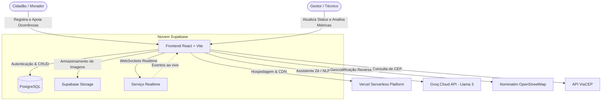
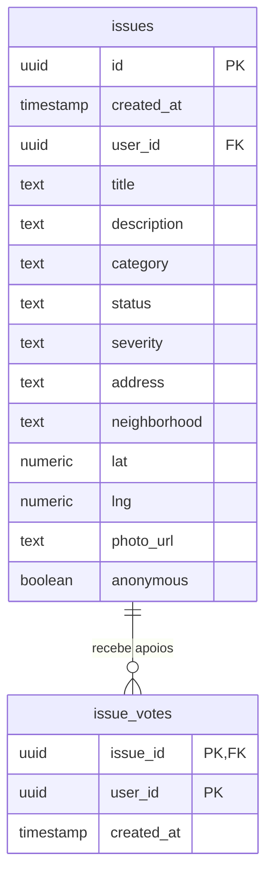

# 🏛️ ZelaBelém — Central Colaborativa de Inteligência Urbana

> **Plataforma web para registro, mapeamento geolocalizado, priorização comunitária e gestão transparente de problemas urbanos em Belém do Pará.**

[](https://zelabelem.vercel.app/)
[](https://react.dev/)
[](https://www.typescriptlang.org/)
[](https://vitejs.dev/)
[](https://tailwindcss.com/)
[](https://supabase.com/)
[](https://groq.com/)

🌐 **Acesse a aplicação em produção:** [zelabelem.vercel.app](https://zelabelem.vercel.app/)

---

## 📌 Sumário
- [Sobre o Projeto](#-sobre-o-projeto)
- [Contexto de Belém & Impacto Social](#-contexto-de-belém--impacto-social)
- [Principais Funcionalidades](#-principais-funcionalidades)
- [Arquitetura do Sistema](#-arquitetura-do-sistema)
- [Stack Tecnológica](#-stack-tecnológica)
- [Modelo de Dados](#-modelo-de-dados)
- [Como Executar Localmente](#-como-executar-localmente)
- [Variáveis de Ambiente](#-variáveis-de-ambiente)
- [Scripts Disponíveis](#-scripts-disponíveis)
- [Estrutura de Pastas](#-estrutura-de-pastas)
- [Contribuindo & Licença](#-contribuindo--licença)

---

## 📖 Sobre o Projeto

O **ZelaBelém** é um sistema colaborativo de inteligência urbana desenvolvido para estreitar a ponte entre os cidadãos de Belém e o poder público. 

A plataforma permite que moradores relatem problemas na infraestrutura de suas vias e bairros com fotos e localização exata no mapa, acompanhem a resolução em tempo real e apoiem ocorrências já abertas por vizinhos. Isso gera dados estratégicos que auxiliam órgãos municipais (como Seurb, SESAN e Defesa Civil) a identificar pontos críticos e priorizar manutenções com base no engajamento comunitário.

---

## 📍 Contexto de Belém & Impacto Social

A capital paraense convive com desafios crônicos de infraestrutura:
* **Vias e Pavimentação:** Buracos asfálticos e falta de calçamento seguro.
* **Resíduos Sólidos:** Descarte inadequado e acúmulo de lixo em vias públicas e esquinas.
* **Drenagem e Marés:** Alagamentos frequentes agravados pelas chuvas equatoriais e canais urbanos.
* **Iluminação Pública:** Trechos com lâmpadas apagadas ou fiação danificada, elevando a sensação de insegurança.

### Benefícios proporcionados:
- **Cidadania Ativa:** Facilita o papel do cidadão como fiscalizador de sua comunidade de forma acessível.
- **Priorização Democrática:** Ocorrências com mais apoios de moradores ganham destaque na triagem pública.
- **Transparência Pública:** Acompanhamento visual da evolução de cada chamado do estado *"Aberto"* ao *"Resolvido"*.

---

## ✨ Principais Funcionalidades

### 🗺️ Mapeamento Interativo e Geolocalização
- Renderização de mapa dinâmico de Belém utilizando **Leaflet** e **OpenStreetMap**.
- Marcadores de ocorrências coloridos pelo nível de severidade (*Baixa*, *Média*, *Alta*, *Crítica*).
- Seleção de local por clique no mapa com **geocodificação reversa automática** (Nominatim) e busca por CEP (**ViaCEP**).

### 🤖 "Assistente Zé" — Atendimento com IA
- Assistente virtual integrado à API da **Groq Cloud** rodando modelos **Llama-3**.
- Conversação em linguagem natural que compreende o relato do cidadão, identifica categoria, gravidade e endereço, e preenche automaticamente o rascunho da ocorrência.
- Sistema de *fallback* local inteligente para garantir funcionamento mesmo se a chave de IA não estiver disponível.

### 📸 Relato com Fotos e Compressão Inteligente
- Upload de fotos como evidência de problemas.
- Compressão e redimensionamento client-side (Canvas API) antes do envio, economizando banda e armazenamento.

### 👥 Sistema de Apoio Comunitário (Votação)
- Moradores podem apoiar chamados registrados por outros cidadãos com apenas um clique.
- Prevenção de votos duplicados por meio de restrições relacionais e views agregadoras.

### 📊 Painel Administrativo de Gestão
- Visão consolidada para técnicos e gestores públicos.
- Métricas em cards: total de chamados, tempo médio estimado, bairros mais incidentes e categorias dominantes.
- Atualização direta de status (`aberto` ➔ `em análise` ➔ `resolvido`).

### ⚡ Sincronização em Tempo Real (Realtime)
- Conexão via **WebSockets** com o Supabase.
- Novas ocorrências e alterações de status aparecem instantaneamente na tela de todos os usuários sem necessidade de recarregar a página.

### 🌓 Interface Acessível com Temas Claro e Escuro
- Design moderno, responsivo e adaptado para telas mobile e desktop.
- Alternância instantânea entre modo escuro (Dark) e claro (Light).

---

## 🏛️ Arquitetura do Sistema



---

## 💻 Stack Tecnológica

| Camada | Ferramenta / Biblioteca | Descrição |
| :--- | :--- | :--- |
| **Frontend** | [React 19](https://react.dev/) + [TypeScript](https://www.typescriptlang.org/) | Biblioteca de interface com tipagem estática rigorosa |
| **Build Tool** | [Vite 6](https://vitejs.dev/) | Ambiente de desenvolvimento rápido com HMR instantâneo |
| **Estilização** | [Tailwind CSS v4](https://tailwindcss.com/) | Framework utilitário de CSS moderno |
| **Componentes UI** | [Radix UI](https://www.radix-ui.com/) + [Lucide Icons](https://lucide.dev/) | Primitivos acessíveis e ícones vetorizados |
| **Mapas** | [Leaflet](https://leafletjs.com/) + [React-Leaflet](https://react-leaflet.js.org/) | Biblioteca de mapeamento espacial interativo |
| **Backend & Banco** | [Supabase](https://supabase.com/) (PostgreSQL 15) | Banco relacional com RLS, Auth, Storage e WebSockets |
| **Inteligência Artificial** | [Groq Cloud](https://groq.com/) (Llama-3) | Processamento de linguagem natural do Assistente Zé |
| **Geocodificação** | OpenStreetMap Nominatim + ViaCEP | Resolução de coordenadas, bairros e endereços |
| **Notificações** | [Sonner](https://sonner.emilkowal.ski/) | Toasts modernos e não-intrusivos |
| **Hospedagem** | [Vercel](https://vercel.com/) | Deploy automatizado contínuo (CI/CD) |

---

## 🗄️ Modelo de Dados

O banco de dados relacional utiliza o **PostgreSQL** hospedado no Supabase com suporte a **Row Level Security (RLS)**:



* **`issues`**: Tabela principal com todas as ocorrências urbanas cadastradas.
* **`issue_votes`**: Tabela de votos de apoio, garantindo relação N:1 única por usuário e ocorrência.
* **`issue_vote_counts`**: View agregadora SQL calculando o número total de votos por problema para ordenação rápida.

---

## 🚀 Como Executar Localmente

### Pré-requisitos
- [Node.js](https://nodejs.org/) (versão 18.x ou superior)
- Gerenciador de pacotes `npm`

### Passo a Passo

1. **Clone o repositório:**
   ```bash
   git clone https://github.com/GRB-04/ZelaBelem.git
   cd ZelaBelem
   ```

2. **Instale as dependências:**
   ```bash
   npm install
   ```

3. **Crie o arquivo de variáveis de ambiente:**
   Crie um arquivo `.env` na raiz do projeto:
   ```env
   VITE_SUPABASE_URL=https://seu-projeto.supabase.co
   VITE_SUPABASE_ANON_KEY=sua-chave-anon-publica
   VITE_GROQ_API_KEY=sua-chave-da-groq-aqui
   ```

4. **Inicie o servidor de desenvolvimento:**
   ```bash
   npm run dev
   ```
   Acesse a aplicação no navegador em `http://localhost:5173`.

---

## ⚙️ Variáveis de Ambiente

| Variável | Obrigatória? | Descrição |
| :--- | :---: | :--- |
| `VITE_SUPABASE_URL` | **Sim** | URL base do seu projeto Supabase |
| `VITE_SUPABASE_ANON_KEY` | **Sim** | Chave pública anônima do Supabase |
| `VITE_GROQ_API_KEY` | *Opcional* | Chave de API da Groq para habilitar a IA no Assistente Zé (se omitida, o assistente utiliza respostas locais) |

---

## 🛠️ Scripts Disponíveis

* `npm run dev`: Inicia o servidor local do Vite com recarregamento em tempo real (HMR).
* `npm run build`: Compila o TypeScript e gera o pacote otimizado para produção na pasta `dist/`.
* `npm run preview`: Executa localmente o bundle de produção gerado.
* `npm run lint`: Executa a verificação estática de código com o ESLint.

---

## 📁 Estrutura de Pastas

```text
ZelaBelem/
├── public/                 # Imagens, favicon e logos estáticos
├── src/
│   ├── app/                # Fluxos principais (Dashboard, Login, Telas)
│   ├── components/         # Componentes modulares reutilizáveis
│   │   ├── MetricCard.tsx              # Cards de indicadores
│   │   ├── OccurrenceCard.tsx          # Card da ocorrência na lista
│   │   ├── OccurrenceDetailModal.tsx   # Modal de detalhes e votos
│   │   ├── OccurrenceList.tsx          # Lista lateral filtrável
│   │   ├── OccurrenceMap.tsx           # Mapa interativo Leaflet
│   │   ├── ReportIssueModal.tsx        # Formulário de novo relato
│   │   ├── TopBar.tsx                  # Barra superior de navegação
│   │   └── UrbanAssistantChat.tsx      # Interface do Assistente Zé
│   ├── lib/                # Configurações do Supabase e queries
│   ├── pages/              # Páginas da aplicação
│   ├── services/           # Integrações (Groq AI e Geocodificação)
│   ├── types/              # Definições de tipos TypeScript
│   ├── index.css           # Estilos globais e tokens Tailwind CSS
│   └── main.tsx            # Ponto de entrada da aplicação React
├── package.json            # Dependências e scripts do projeto
├── vite.config.ts          # Configurações do bundler Vite
└── README.md               # Documentação oficial do projeto
```

---

## 📄 Contribuindo & Licença

Contribuições, correções e sugestões são muito bem-vindas! Sinta-se à vontade para abrir uma *Issue* ou enviar um *Pull Request*.

Desenvolvido para fins acadêmicos e sociais integrando as disciplinas de **Engenharia de Software**, **Banco de Dados**, **Arquitetura de Software**, **Cloud Computing** e **UX/UI**.
